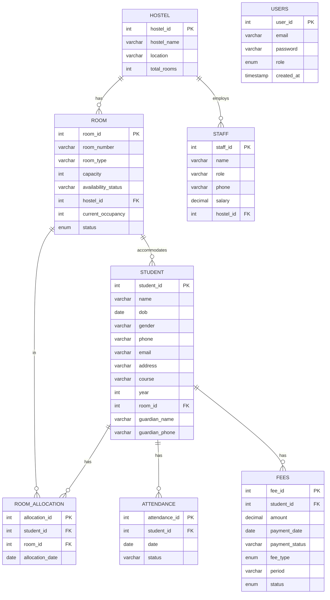

# Hostel Management – ER Diagram

Entity-relationship diagram for database **hostel_management**. View this file in VS Code (with a Mermaid extension), on GitHub, or at [mermaid.live](https://mermaid.live).

## Relationship summary

| From | To | Cardinality | FK |
|------|-----|-------------|-----|
| hostel | room | 1 : N | room.hostel_id |
| hostel | staff | 1 : N | staff.hostel_id |
| room | student | 1 : N | student.room_id |
| room | room_allocation | 1 : N | room_allocation.room_id |
| student | room_allocation | 1 : N | room_allocation.student_id |
| student | attendance | 1 : N | attendance.student_id |
| student | fees | 1 : N | fees.student_id |

**users** has no foreign key in the schema; it is linked to student/staff in application logic by role.
